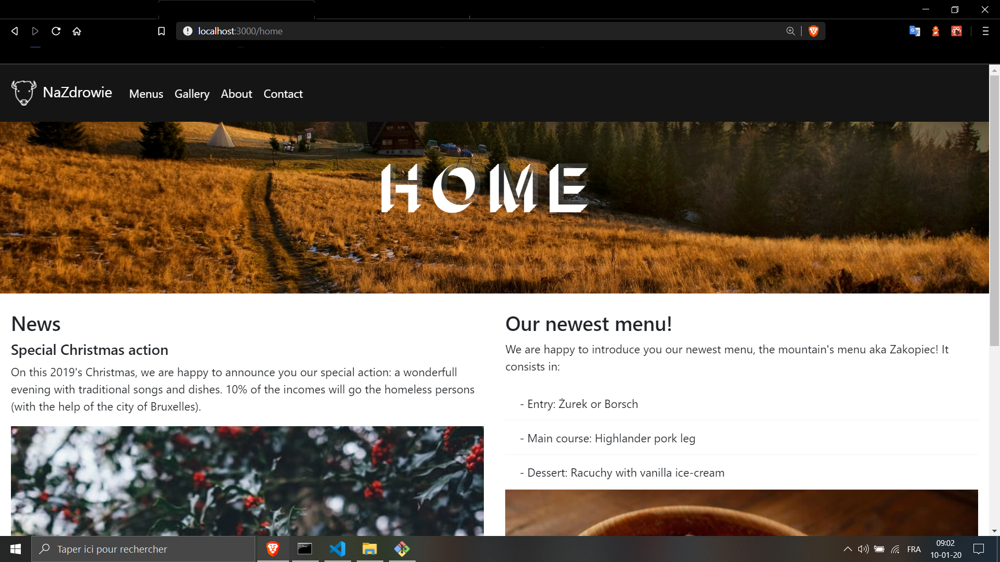

# Na Zdrowie Restaurant V2 🍽️
<p align="center">
My older version of the the project: <br>
-> https://github.com/MathieuKruk/NaZdrowie-Restaurant-V1 <-
</p>

## ◾ Features

<ul>
  <li>Na Zdrowie is a static website made for a fictional restaurant.</li>
  <li>It tries to provide a better visibility and increase the communication</li>
</ul>

<hr>

<p align="center">
  
</p>

<hr>

## ◾ Motivation

It has been launch the 💠13/11/2019💠 in the case of a school project (<a href="https://github.com/becodeorg" target="_blank">BeCode</a>).

Below, you will find our guidelines hosted on the school repo: 
▪️▪️▪️▪️▪️▪️▪️▪️▪️▪️▪️▪️▪️▪️▪️▪️▪️▪️▪️▪️▪️▪️▪️▪️▪️▪️▪️▪️▪️▪️▪️▪️▪️▪️▪️▪️▪️▪️▪️▪️▪️▪️▪️▪️▪️▪️▪️▪️▪️▪️▪️▪️▪️▪️▪️▪️▪️▪️▪️▪️▪️▪️▪️▪️▪️▪️▪️▪️▪️▪️▪️▪️▪️▪️▪️▪️▪️▪️▪️▪️▪️▪️▪️▪️▪️▪️▪️▪️▪️▪️▪️▪️▪️▪️▪️▪️▪️▪️▪️▪️▪️▪️▪️▪️▪️▪️▪️▪️▪️▪️▪️▪️▪️▪️▪️▪️▪️▪️▪️▪️▪️▪️▪️▪️▪️▪️▪️

Once upon a time *you made a website* for a restaurant franchise. Now and after
hearing about the wonderful work you did for the _COGIP_ from _Jean-Christian
Ranu_ and _Muriel Perrache_, their best customers, the owner is calling you back
to implement new features and *improve the website*.

Sadly, he can only pay you for a week of work, which *won't be enough time* to
implement all his ideas. Hopefully, he's ready to make compromises, you have to
*implement as much as you can* in the given time.

.Instructions
* take back your old link:../03-HTML-CSS/bootstrap/restaurant.adoc[project] 
* implement at least one new feature
* improve the design (if you have time)
* use whatever technology you want

NOTE: You don't have to fill any form for this project, as it's a learning
challenge. However, if you feel it could unlock *badges* you can try to claim
them with it.

=== Features

==== Chatbot

One of the idea the owner had was to implement a {chatbot}[chatbot] to the
website. The goal is to answer the common asked questions of the customers in an
interactive way.

[%header]
|===
| Frequently asked questions | Answers

| What are the opening hours?
| The opening hours are from <time> to <time>

| Do you deliver?
| Yes, we do.

| Do you like accounting?
| No Ranu, stop stalking me.
|===

Feel free to propose new questions/answers to the customer.

==== Shop

Another, much needed feature would be an online shop to order food from the menu
page. It should be able to calculate the VAT, and the delivery price, as well
as, deduce money if the customer as a promotion code (_ViveLaCOGIP_).

For the delivery price, you can do it the easy way and use a fix price or the
fun way and calculate it in regards to the distance from the customer house to
one of the restaurants (hint: API).

==== Guest book

Finally, the owner would like to have a new {guestbook}[guest book] page to
receive comments, kind words or advice from the customers. However, it ideally
need to be made with the *google sheet API* to allow the owner to check
everything directly from his _google account_.

The form should at least contain:

* customer name
* visited restaurant
* visit date
* comment (optional input)

==== Geolocalisation

A _nice to have_ would be to allow the visitor to enter his address on an input
near the map to check the closest restaurant.

=== Resources

* https://botman.io/[botman] 
* https://getcomposer.org/[composer]
* https://tinyurl.com/yxda5q7o[add composer on a docker image]
* https://developers.google.com/sheets/api/quickstart/php[google sheet API]

▪️▪️▪️▪️▪️▪️▪️▪️▪️▪️▪️▪️▪️▪️▪️▪️▪️▪️▪️▪️▪️▪️▪️▪️▪️▪️▪️▪️▪️▪️▪️▪️▪️▪️▪️▪️▪️▪️▪️▪️▪️▪️▪️▪️▪️▪️▪️▪️▪️▪️▪️▪️▪️▪️▪️▪️▪️▪️▪️▪️▪️▪️▪️▪️▪️▪️▪️▪️▪️▪️▪️▪️▪️▪️▪️▪️▪️▪️▪️▪️▪️▪️▪️▪️▪️▪️▪️▪️▪️▪️▪️▪️▪️▪️▪️▪️▪️▪️▪️▪️▪️▪️▪️▪️▪️▪️▪️▪️▪️▪️▪️▪️▪️▪️▪️▪️▪️▪️▪️▪️▪️▪️▪️▪️▪️▪️▪️

<hr>

## ◾ Tasks

- [x] Initialize the ReadMe and the trello.
- [x] First static version of the website.
- [ ] Launch the app.

ℹ️ For further informations, please make sure to visit my **Trello** [board](https://trello.com/b/wkDPM6CS/na-zdrowie-restaurant) (only in french).

<hr>

## ◾ Build status

📲 V2.0.1
Logs
   - Added a Dialogflow Chatbot.
   - Switched the website on React tech.
   - Added React-Bootstrap package.
   - Finished the website design with bootstrap and sass.
   - Fixed the responsive behavior of the google map.
   - ...

<hr>

## ◾ Screenshots

### Homepage
<p align="center">
  
</p>

<hr>

## ◾ Tech/framework used

1. Front-end
   - [React](https://reactjs.org/)
   - [React-Bootstrap](https://react-bootstrap.github.io/)
   - [Sass](https://sass-lang.com/)
   - [Font Awesome 4.7](https://fontawesome.com/v4.7.0/)
   
2. Others
   - [Dialogflow](https://dialogflow.com/)

<hr>

## ◾ Code Example

### React router
```
<BrowserRouter>
 <NavigationBar changeRoute={this.changeRouteHandler.bind(this)} />
  <JumbotronHeader pathname={this.state.pathname} /> 
   <Switch>
       <Redirect from="/" to="/home" exact/>
       <Route path="/home" component={Home} exact/>
       <Route path="/Menus" component={Menus}/>
       <Route path="/Gallery" component={Gallery}/>
       <Route path="/About" component={About}/>
       <Route path="/Contact" component={Contact}/>
     <Route component={Error}/>
   </Switch>
  <Chatbot />
 <Footer /> 
</BrowserRouter>
```

<hr>

## ◾ Credits

[Mathieu Kruk](https://github.com/MathieuKruk)

Special thanks to:
- [Phil](https://github.com/philesgilles), for helping me setting up the react router and implement the history function.
<hr>

## ◾ License

OpenSource | Free

<hr>
<br>

<p align="right">
  ✍️ Readme Author:
  <a href="https://github.com/MathieuKruk">Mathieu Kruk</a>
</p>

<p align="right">
  
</p>
